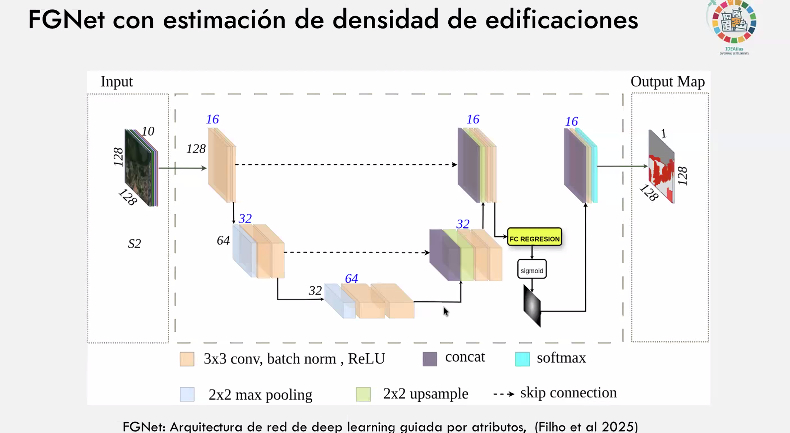

# IDEAtlas_workshop
IDEAtlas: mapping urban deprivation using AI and Earth Observation data.

More info [here](https://www.ideamapsnetwork.org/project/ideatlas)

# Architecture

Mlti-Branch Convolutional Neural Network (MB-CNN) building on the U-Net architecture (Ronneberger et al., 2015) 
